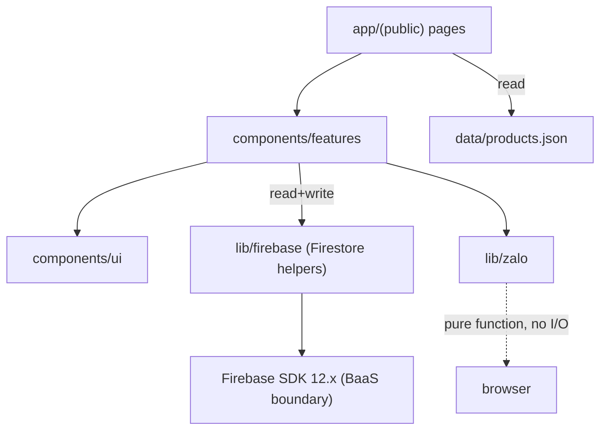
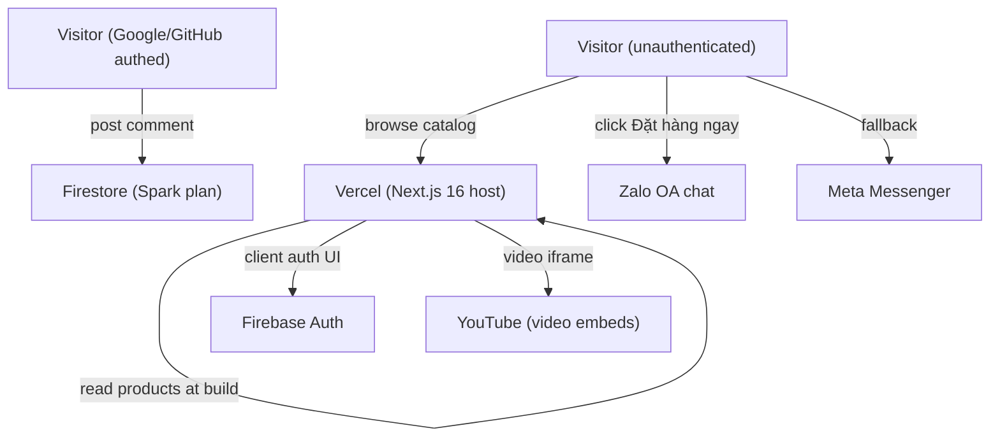
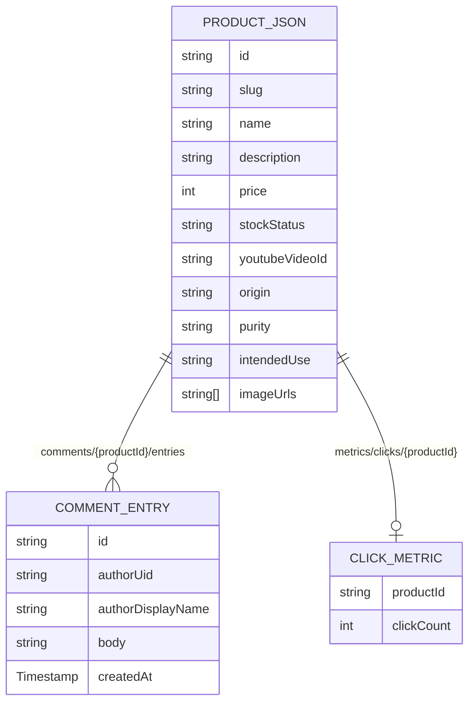

# Architecture Spine — Zero-Backend Natural Products Ecommerce

## Design Paradigm

**Layered Static-First with BaaS Islands**

The storefront is a statically generated shell (Next.js 16 App Router, SSG). Dynamic behavior is isolated to one type of "island" that doesn't pollute the static shell:

| Island type | Mechanism | Routes |
|---|---|---|
| **Real-time island** | Firestore client listener | PDP comments section |
| **Client state island** | Zustand / LocalStorage | Cart drawer and header cart icon |

Layer map:

```
app/
  (public)/      → SSG (Static JSON read at build, deployed via Vercel CI/CD)
lib/
  firebase/      → BaaS client init + typed Firestore helpers
  zalo/          → Handoff URL composer
components/
  ui/            → Presentational only (no data fetching)
  features/      → Data-aware, co-located with their island type
```

Dependency direction — who may import whom:



No component or page may import directly from `app/`. `lib/firebase` is the only layer that touches the Firebase SDK.

---

## Invariants & Rules

### AD-1 — Route-scoped rendering strategy

- **Binds:** FR-1.2, FR-1.3, all public routes
- **Prevents:** a builder SSR-ing a PDP (kills SEO caching), or fetching comments server-side (unnecessary rebuild coupling)
- **Rule:**
  - `/` and `/san-pham/[slug]` — SSG at build time; Static product data fetched from local JSON in `generateStaticParams` + `generateMetadata`. `dynamicParams = false`.
  - `/san-pham/[slug]` comments section — client component, Firestore `onSnapshot` listener, never pre-rendered.

### AD-2 — Firestore data boundary

- **Binds:** FR-2.1, FR-2.2
- **Prevents:** comments being written without auth; metrics living outside Firestore
- **Rule:**
  - `comments/{productId}/entries/{commentId}` — write: authenticated users only (Google/GitHub, enforced by Firestore security rules). Read: public (unauthenticated). Comments are post-only (no edit or delete).
  - `metrics/clicks/{productId}` — increment-only, written by a client-side Firestore `increment()` call on "Đặt hàng ngay" click. No other writer.

### AD-3 — Static Catalog Management

- **Binds:** FR-4.1, NFR-1
- **Prevents:** database roundtrips for catalog data; unnecessary backend complexity
- **Rule:** The canonical source of truth for products is a static `data/products.json` (or `.ts`) file in the codebase. Admin updates require a code commit, and changes are propagated globally via Vercel CI/CD builds.

### AD-4 — Comment Auth Gate

- **Binds:** FR-2.3
- **Prevents:** comment auth being enforced only in UI (bypassable if Firestore rules are absent)
- **Rule:**
  - **Comment gate (Firestore rules only):** `comments/{productId}/entries` write rule requires `request.auth != null`. Google/GitHub providers only (configured in Firebase Console).
  - Client-side auth UI is a UX convenience only — never the security enforcement point.

### AD-5 — Zalo handoff encoding

- **Binds:** FR-3.1
- **Prevents:** broken deep links from unencoded special characters
- **Rule:**
  - Handoff compiled in `lib/zalo/composeHandoff.ts` (pure function, no I/O).
  - Output format (Vietnamese): `"Đơn hàng mới:\n- {qty}x {name} ({price}đ)\n...\nTổng cộng: {total}đ\n\nNgười nhận: {customerName}\nSĐT: {phone}\nĐịa chỉ: {address}"`.
  - Final URL: `https://zalo.me/${NEXT_PUBLIC_ZALO_OA_ID}?text=${encodeURIComponent(message)}`.
  - Messenger fallback: `https://m.me/${NEXT_PUBLIC_MESSENGER_PAGE_ID}?ref=${encodeURIComponent(message)}`.
  - Both URLs rendered as CTA buttons on the Cart Drawer. Zalo is primary.

### AD-6 — Client-side Cart State

- **Binds:** FR-3.1, NFR-1
- **Prevents:** server-side complexity for order management; data loss on reload
- **Rule:**
  - Cart state and user delivery details are managed purely client-side (e.g., Zustand) and persisted to `localStorage`.
  - Components reading cart state must ensure they only render on the client (or handle hydration gracefully) to prevent SSR hydration mismatches.

---

## Consistency Conventions

| Concern | Convention |
|---|---|
| **Naming — files** | kebab-case for all files and directories; named exports only (no `default export` in `lib/`); `page.tsx`, `layout.tsx`, `loading.tsx` follow Next.js conventions |
| **Naming — Firestore collections** | camelCase collection names (`comments`, `metrics`); document IDs are auto-generated except `metrics/clicks/{productId}` which mirrors the static productId |
| **Naming — env vars** | `NEXT_PUBLIC_` prefix only for vars safe in the browser |
| **Data — IDs** | Firestore auto-IDs (strings) everywhere; no numeric or sequential IDs |
| **Data — prices** | Stored as integers (Vietnamese Đồng, no decimal); displayed with `toLocaleString('vi-VN')` |
| **Data — dates** | Firestore `Timestamp`; converted to ISO-8601 string at the `lib/firebase` boundary before passing to components |
| **State mutation** | Cart uses client-side Zustand store; comments use Firestore client helper. No inline mutations in UI components |
| **Auth** | Firebase Auth only; client-side SDK is sufficient |
| **Logging** | `console.error` in development |
| **i18n** | No i18n library; all UI strings are Vietnamese literals in components. English only in code identifiers and comments |
| **Styling** | Tailwind CSS v4 utility classes with `shadcn/ui` components; global tokens in `app/globals.css` |

---

## Stack

| Name | Version |
|---|---|
| Next.js | 16.2.11 |
| React | 19.x (bundled with Next.js 16) |
| Firebase JS SDK | 12.16.0 |
| TypeScript | 5.x |
| Tailwind CSS | 4.x (with shadcn/ui components) |
| Vercel | Platform (Next.js 16 runtime) |
| Firebase Hosting | Not used — Vercel only |
| Firebase Auth | Google + GitHub providers |
| Firestore | Native mode, Spark plan |
| Firebase Storage | Not used for video (YouTube embeds) |

---

## Structural Seed

```text
truongan-cao/               # project root
  app/
    (public)/
      page.tsx              # product listing — SSG
      san-pham/
        [slug]/
          page.tsx          # PDP — SSG
          loading.tsx
    layout.tsx
    globals.css
  components/
    ui/                     # presentational: Button, Card, Badge, etc.
    features/
      ProductCard.tsx
      ProductComments.tsx   # real-time island (client component)
      CartDrawer.tsx        # client state island (reads Zustand, handles checkout)
  lib/
    firebase/
      client.ts             # Firebase app init (client-side)
      comments.ts           # typed Firestore helpers (read/write comments)
      metrics.ts            # typed Firestore helpers (increment clicks)
    zalo/
      composeHandoff.ts     # pure fn: cart + user info → {zaloUrl, messengerUrl}
    store/
      cart.ts               # Zustand store persisted to localStorage
  data/
    products.json           # static catalog database
  next.config.ts
  .env.local                # NEXT_PUBLIC_ZALO_OA_ID, NEXT_PUBLIC_MESSENGER_PAGE_ID,
                            # FIREBASE_SERVICE_ACCOUNT_KEY
```

### System context



### Data shape (seed)



---

## Capability → Architecture Map

| Capability / FR | Lives in | Governed by |
|---|---|---|
| FR-1.1 Product Listing | `app/(public)/page.tsx` | AD-1 (SSG), AD-3 (Static Data) |
| FR-1.2 SEO Optimization | `app/(public)/**/page.tsx` + `generateMetadata` | AD-1 (SSG mandatory) |
| FR-1.3 Video Previews | `components/features/ProductCard.tsx`, PDP | Convention: YouTube embeds only (no Firebase Storage) |
| FR-2.1 View Comments | `components/features/ProductComments.tsx` | AD-1 (client listener, not SSR), AD-2 (public read rule) |
| FR-2.2 Post Comment | `lib/firebase/comments.ts` | AD-2 (Firestore write, post-only), AD-4 (auth required) |
| FR-2.3 Auth for Comments | Firebase Auth + Firestore rules | AD-4 (layer 2 — rules) |
| FR-3.1 Cart and Order Handoff | `components/features/CartDrawer.tsx`, `store/cart.ts` | AD-5 (Zalo handoff), AD-6 (Client cart state) |
| FR-4.1 Static Catalog | `data/products.json` | AD-3 (Static codebase management) |
| NFR-2 Free Tier + Quota Errors | `lib/firebase/` error boundary | AD-2 (catch at BaaS boundary, degrade comments gracefully) |
