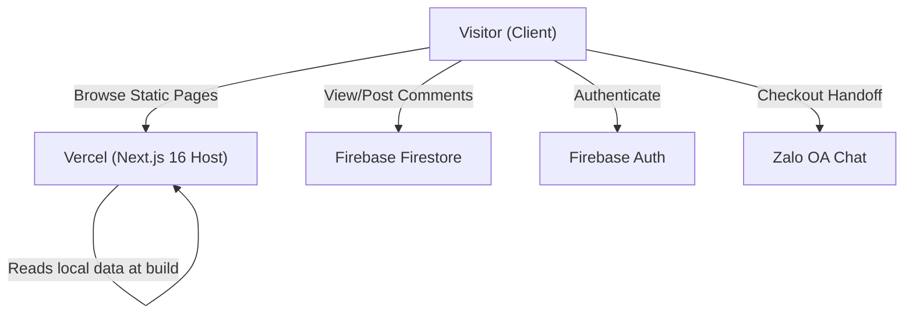
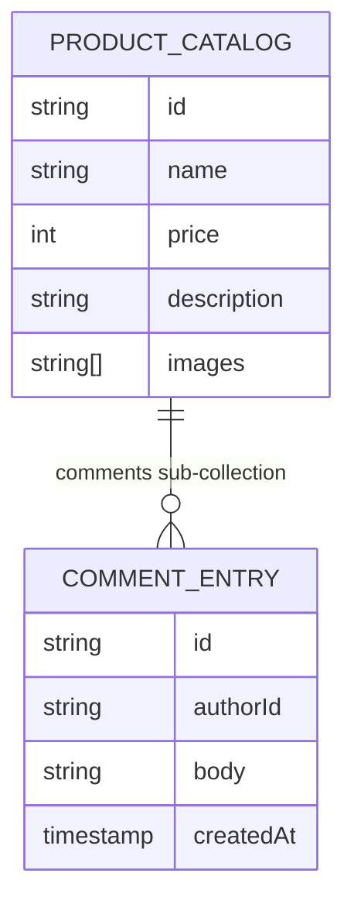

# Architecture Spine — custom-architecture-spine

## Design Paradigm

**Static-First with BaaS Client Islands**
The system is built on a rigid separation between the static core and dynamic edges. The core product catalog is pre-rendered at build time (Static Site Generation) using local data, ensuring maximum performance and zero database reads. Dynamic features (comments, authentication, cart) are injected as isolated client-side "islands" that communicate directly with a Backend-as-a-Service (Firebase), completely bypassing any custom application server.

## Invariants & Rules

### AD-1 — Strict SSG Catalog
- **Binds:** `catalog/pages`, `app/` routes
- **Prevents:** CDN cache misses, slow Time-To-First-Byte (TTFB), and accidental database roundtrips during runtime.
- **Rule:** All product and catalog routes MUST use `dynamicParams = false` and be Statically Generated (SSG) at build time. Server-Side Rendering (SSR) is strictly forbidden for the catalog.

### AD-2 — BaaS Client Islands
- **Binds:** `comments`, `auth`, `ui-components`
- **Prevents:** Server-side coupling with Firebase, build-time timeouts, and breaking the SSG cache.
- **Rule:** Dynamic features must be implemented strictly as Client Components (`"use client"`). Server components must NEVER import or invoke the Firebase SDK.

### AD-3 — Client-Only Checkout State
- **Binds:** `checkout`, `cart`, `zalo-handoff`
- **Prevents:** Backend order state management overhead and the need for a custom checkout server.
- **Rule:** The Cart must rely purely on client-side state (React Context/Zustand) and `localStorage`. The Zalo/Messenger deep-link handoff must be computed synchronously in the browser as a pure function.

### AD-4 — Static Data Boundary
- **Binds:** `product-data`, `catalog`
- **Prevents:** Database query quota exhaustion and the need for a CMS administration dashboard.
- **Rule:** Product data must be managed exclusively within the codebase (e.g., `data/products.json`). Firestore must NOT be used to store or fetch product catalog data.

### AD-5 — Trusted Security Boundary
- **Binds:** `comments-security`, `firestore`
- **Prevents:** Spam and unauthorized database writes from bypassed client-side validation.
- **Rule:** The client-side UI is for UX only. Firestore Security Rules (`request.auth != null`) are the sole enforcement layer for write operations.

## Consistency Conventions

| Concern | Convention |
| --- | --- |
| **Naming (Files)** | Use `kebab-case` for all files, except standard Next.js routing files. |
| **Data Format (Currency)** | Store and compute all financial values (prices) as integers (VND) with no decimals. |
| **Error Handling (BaaS)** | Handle Firebase quota errors gracefully at the `lib/firebase` boundary to prevent UI crashes. |
| **URL Encoding** | Handoff URLs must strictly use `encodeURIComponent()` to safely handle Vietnamese characters. |

## Stack

| Name | Version |
| --- | --- |
| Next.js (App Router) | 16.x |
| React | 19.x |
| Firebase JS SDK (Auth, Firestore) | 12.x |
| Tailwind CSS & shadcn/ui | 4.x |
| Deployment | Vercel |

## Zoning Laws (Structural Seed)

Instead of a rigid file tree, the following zoning conventions apply:

- `app/(public)/**/page.tsx` — Reserved for strictly SSG static routes.
- `components/features/` — Reserved for Client Component islands containing dynamic behavior.
- `components/ui/` — Reserved for pure presentational components.
- `data/` — Single source of truth for static catalog JSON/TS data.
- `lib/firebase/` — The ONLY zone permitted to import or initialize the Firebase SDK.
- `lib/zalo/` — Reserved for pure functions related to URL generation and handoff logic.

## Visual Architecture

### System Context

### Data Model

## Deferred

- **E2E Testing Strategy:** Deferred until post-MVP. We will rely on unit testing for pure functions and manual verification for the MVP handoff.
- **Analytics & Tracking:** Exact event schemas for tracking "Thêm vào giỏ" clicks are deferred to the implementation phase.
- **Admin Authentication:** The mechanism for whitelisting admin emails for future catalog editing features is deferred, as v1 relies on git commits.
